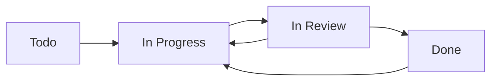

# SOP 02: Linear Project Management Protocol

**Version:** 1.0  
**Created:** 2025-01-31  
**Last Modified:** 2025-01-31  

## Overview

This SOP defines the comprehensive protocols for managing all project activities through Linear. Every task, bug fix, feature request, and maintenance activity MUST be tracked as an issue in Linear using the standardized procedures defined herein.

## Core Principles

1. **Linear is the Single Source of Truth**: All work items must exist as Linear issues
2. **Never Mark Done Prematurely**: Parent issues can only be marked "Done" after ALL sub-agent work is complete
3. **Contextual Awareness**: All agents must check surrounding issues to prevent duplication
4. **Comprehensive Logging**: All activities, references, and decisions must be documented

## 1. Issue Hierarchy and Numbering System

### 1.1 Primary Issues
Primary issues represent major work units (e.g., "Implement user authentication", "Set up CI/CD pipeline").

**Format:** `[Number]: [Description]`
**Example:** `1: Initialize project structure`

### 1.2 Semantic Sub-Issues
When primary issues need breakdown, create NEW independent issues with semantic numbering:

**Format:** `[Parent].[Sub]: [Description]`
**Examples:**
- `1.1: Configure TypeScript compiler`
- `1.1.1: Set up strict mode configuration`
- `1.1.2: Configure path mapping`

### 1.3 Linear Native Sub-Issues (Agent Work Tracking)
Linear's built-in sub-issues are EXCLUSIVELY for agent work documentation:

**Format:** `[Agent Type] for [Parent Issue]`
**Examples:**
- `Code Review for 1.1`
- `Testing Analysis for 1.1`
- `CI/CD Integration for 1.1`
- `Documentation & Orchestration for 1.1`

## 2. Mandatory Issue Fields

### 2.1 Title Requirements
- MUST start with issue number
- MUST be descriptive and actionable
- MUST use consistent terminology from project glossary
- Maximum 80 characters for readability

### 2.2 Description Requirements
**Template:**
```markdown
## Overview
Brief description of what needs to be accomplished.

## Acceptance Criteria
- [ ] Specific, measurable criteria
- [ ] Each criterion must be testable
- [ ] Include performance requirements if applicable

## Technical Requirements
- Specific technical constraints
- Dependencies on other issues
- Required tools or technologies

## Definition of Done
- [ ] Code implemented and tested
- [ ] All sub-agent reviews completed
- [ ] Documentation updated
- [ ] Integration tests passing
```

### 2.3 Required Field Configuration
- **Status**: `Todo` → `In Progress` → `In Review` → `Done`
- **Priority**: `No Priority` | `Low` | `Medium` | `High` | `Urgent`
- **Owner**: Assigned agent or human
- **Labels**: Component, type, and feature labels
- **Project**: Must be assigned to correct Linear project
- **Estimate**: Story points or time estimate

## 3. Status Management Protocol

### 3.1 Status Transitions



### 3.2 Status Update Rules

**Todo → In Progress:**
- Triggered when agent begins work
- Must create corresponding Git work tree
- Must update Linear with work tree information

**In Progress → In Review:**
- Triggered when primary agent completes implementation
- All local tests must pass
- Initial commit must be made
- Sub-agent workflow must be initiated

**In Review → Done:**
- ALL sub-agent reviews must be complete
- ALL sub-issues must be resolved
- Human approval may be required for critical issues
- CI/CD pipeline must be passing

## 4. Activity Logging Protocol

### 4.1 Primary Agent Logging
All primary agent activities logged in parent issue:

**Required Log Entries:**
- Work start timestamp and work tree creation
- Each significant development milestone
- Error encounters and resolution attempts
- External resource usage (Context7, documentation)
- Commit hashes and branch references
- Test results and build status
- Work completion timestamp

**Format:**
```markdown
**[Timestamp]** - [Agent ID]: [Action Description]
- Work tree: `work-trees/issue-1.1-typescript-setup`
- Commit: `abc123f - Configure TypeScript strict mode`
- Tests: ✅ All passing
- References: [TypeScript Handbook](https://www.typescriptlang.org/docs/)
```

### 4.2 Sub-Agent Logging
All sub-agent work logged in dedicated sub-issues:

**Code Reviewer:**
- Code quality assessment
- Adherence to coding standards
- Logic and efficiency analysis
- Security review results
- Recommended improvements or new issues

**CI/CD Expert:**
- Pipeline impact analysis
- Configuration requirements
- Environment variable needs
- Deployment considerations
- Integration requirements

**Testing Agent:**
- Test coverage analysis
- Test execution results
- Performance test results
- Bug identification and reporting
- Test enhancement recommendations

**Documentation & Orchestration:**
- Documentation updates made
- Next issue preparation notes
- Dependency analysis
- Resource requirements for next tasks

## 5. Contextual Awareness Protocol

### 5.1 Before Creating New Issues
All agents MUST query Linear for:
- Issues with adjacent numbers (±2 from current issue)
- Issues with similar titles or descriptions
- Issues in same component or feature area
- Open sub-issues that might be relevant

### 5.2 Query Examples
```
# Check for existing related issues
/mcp__linear-server__list_issues query="authentication" state="open"
/mcp__linear-server__list_issues query="setup" project="Gmail Label Manager"

# Check specific adjacent issues
/mcp__linear-server__get_issue id="SAV-12"
/mcp__linear-server__get_issue id="SAV-14"
```

## 6. Linear MCP Integration Requirements

### 6.1 Required MCP Operations
All agents must be capable of:
- Creating issues with proper formatting
- Updating issue status, priority, and assignee
- Adding comments and activity logs
- Creating and managing sub-issues
- Querying existing issues for context awareness
- Linking related issues and external resources

### 6.2 Automation Rules
- Status updates must be immediate when state changes
- All external links must be validated before adding
- Activity logs must be timestamped in UTC
- Error conditions must be logged with sufficient detail for debugging

## 7. Quality Assurance Protocol

### 7.1 Issue Creation Validation
Before creating any issue:
- [ ] Title follows naming convention
- [ ] Description includes all required sections
- [ ] Acceptance criteria are specific and measurable
- [ ] No duplicate issues exist
- [ ] Proper labels and project assignment
- [ ] Dependencies are identified and linked

### 7.2 Issue Completion Validation
Before marking issue as Done:
- [ ] All acceptance criteria met
- [ ] All sub-agent reviews completed
- [ ] Code merged to dev branch
- [ ] CI/CD pipeline passing
- [ ] Documentation updated
- [ ] Next issue primed (if applicable)

## 8. Error Handling and Recovery

### 8.1 Linear API Failures
If Linear MCP operations fail:
1. Log error details locally
2. Attempt retry with exponential backoff
3. If persistent failure, escalate to human review
4. Never proceed with work if Linear cannot be updated

### 8.2 Issue Conflicts
If duplicate or conflicting issues discovered:
1. Halt current work immediately
2. Document conflict in both issues
3. Request human resolution
4. Merge or close duplicates as directed
5. Update all references to consolidated issue

## 9. Reporting and Metrics

### 9.1 Required Metrics
Track and report:
- Issue completion velocity
- Average time in each status
- Sub-agent review completion rates
- Issue quality metrics (rework rate)
- Linear API performance and reliability

### 9.2 Weekly Reports
Generate automated reports including:
- Completed issues summary
- Outstanding issues by priority
- Blocked issues and reasons
- Agent performance metrics
- Linear integration health status

## Success Criteria

Linear management is successful when:
- All work is properly tracked and visible
- No duplicate or conflicting issues exist
- Issue progression follows defined workflow
- All stakeholders can track project progress
- Historical work log is comprehensive and searchable