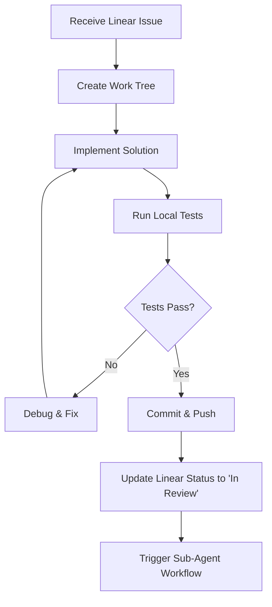

# SOP 04: AI Agent Ecosystem Protocol

**Version:** 1.0  
**Created:** 2025-01-31  
**Last Modified:** 2025-01-31  

## Overview

This SOP defines the comprehensive framework for the AI agent ecosystem, including roles, responsibilities, interaction protocols, and quality assurance measures. Every agent within this ecosystem must operate according to these protocols to ensure consistent, high-quality output.

## Core Principles

1. **Specialization**: Each agent has a specific role and expertise area
2. **Collaboration**: Agents work together through defined handoff protocols
3. **Quality Assurance**: No single agent's work is considered final without review
4. **Transparency**: All agent actions and decisions are logged and auditable
5. **Context Awareness**: Agents must understand their position in the larger workflow

## 1. Agent Hierarchy and Roles

### 1.1 Primary Development Agent (Claude Code)

**Primary Responsibilities:**
- Execute development tasks from Linear issues
- Create and manage Git work trees
- Implement code changes according to specifications
- Run local testing and quality checks
- Maintain comprehensive activity logging
- Trigger sub-agent workflows upon completion

**Authority Level:** High - Can modify codebase, create branches, update Linear
**Reporting:** Reports to Linear issue, triggers sub-agent reviews

### 1.2 Sub-Agent Framework

Each primary issue spawns exactly four sub-agents, each with a dedicated Linear sub-issue:

#### 1.2.1 Code Review Agent
**Sub-issue Title Format:** `Code Review for [PARENT-ISSUE]`
**Primary Responsibilities:**
- Conduct thorough code quality analysis
- Verify adherence to coding standards and best practices
- Check for security vulnerabilities and performance issues
- Validate implementation against issue requirements
- Identify potential bugs or logical errors
- Recommend improvements or create additional issues if needed

**Authority Level:** Medium - Can create new issues, cannot modify code directly
**Critical Stance:** Assumes code is flawed until proven otherwise

#### 1.2.2 CI/CD Integration Expert Agent
**Sub-issue Title Format:** `CI/CD Integration for [PARENT-ISSUE]`
**Primary Responsibilities:**
- Analyze changes for CI/CD pipeline impact
- Identify required environment variable updates
- Document deployment configuration changes
- Assess integration test requirements
- Validate build process compatibility
- Recommend pipeline modifications if needed

**Authority Level:** Medium - Can create configuration issues, cannot modify pipelines directly
**Focus:** Infrastructure and deployment readiness

#### 1.2.3 Testing Agent
**Sub-issue Title Format:** `Testing Analysis for [PARENT-ISSUE]`
**Primary Responsibilities:**
- Develop comprehensive test strategies beyond unit tests
- Execute integration and end-to-end testing
- Perform performance and load testing where applicable
- Validate accessibility compliance
- Create automated test suites
- Report bugs and create bug-fix issues

**Authority Level:** Medium - Can create test-related issues and bug reports
**Scope:** All testing beyond basic unit tests performed by primary agent

#### 1.2.4 Documentation and Orchestration Agent
**Sub-issue Title Format:** `Documentation & Orchestration for [PARENT-ISSUE]`
**Primary Responsibilities:**

**Documentation Tasks:**
- Update project documentation to reflect changes
- Maintain architectural documentation
- Update API documentation if applicable
- Update user-facing documentation
- Maintain changelog and release notes

**Orchestration Tasks:**
- Analyze surrounding Linear issues for conflicts
- Prepare next major issue with contextual information
- Perform pre-investigation of next issue requirements
- Identify required MCP servers and documentation for next issue
- Pass critical information between issue workflows

**Authority Level:** High - Can update documentation, modify issue descriptions
**Unique Role:** Only agent that looks forward to future issues

## 2. Agent Activation and Workflow

### 2.1 Primary Agent Workflow


### 2.2 Sub-Agent Activation Sequence
Sub-agents are triggered sequentially, with each waiting for the previous to complete:

1. **Code Review Agent** (Immediate activation)
2. **CI/CD Expert Agent** (After Code Review)
3. **Testing Agent** (After CI/CD Analysis)
4. **Documentation & Orchestration Agent** (After Testing)

### 2.3 Agent Communication Protocol

**Inter-Agent Communication:**
- No direct communication between agents
- All communication occurs through Linear sub-issues
- Each agent reads previous agents' findings from their sub-issues
- Final status determined by Documentation & Orchestration Agent

**Human Communication:**
- All findings reported in dedicated Linear sub-issues
- Critical issues escalated through Linear priority system
- Human intervention requested via Linear issue flags

## 3. Agent Triggering Mechanisms

### 3.1 Claude Code Hooks Configuration

**Available Hooks:**
- `on-build-success`: Triggered when local build passes
- `on-session-end`: Triggered when development session completes
- `on-commit`: Triggered after successful commit
- `on-merge`: Triggered after merge to dev branch

**Recommended Hook for Sub-Agent Activation:**
```bash
# .claude/hooks/on-build-success.sh
#!/bin/bash
echo "Triggering sub-agent workflow for issue: $ISSUE_ID"
claude /sub-agent-trigger $ISSUE_ID
```

### 3.2 Sub-Agent Invocation

**Sub-Agent Slash Commands:**
```bash
# Trigger individual sub-agents
/code-review [issue-id]
/cicd-analysis [issue-id] 
/testing-analysis [issue-id]
/doc-orchestration [issue-id]

# Trigger complete sub-agent workflow
/sub-agent-workflow [issue-id]
```

## 4. Quality Assurance Protocol

### 4.1 Multi-Level Review Process

**Level 1: Self-Review (Primary Agent)**
- Code compilation and basic functionality
- Unit test execution
- Basic security and performance checks
- Adherence to issue requirements

**Level 2: Specialized Review (Sub-Agents)**
- Detailed code quality analysis
- Infrastructure impact assessment
- Comprehensive testing strategy
- Documentation completeness

**Level 3: Human Review (When Required)**
- Critical business logic changes
- Security-sensitive modifications
- Architectural changes
- Production deployment decisions

### 4.2 Review Completion Criteria

A Linear issue can only be marked "Done" when:
- [ ] Primary agent work is complete and committed
- [ ] All four sub-agent reviews are complete
- [ ] All sub-agent recommendations are addressed or documented
- [ ] Any new issues created by sub-agents are properly linked
- [ ] CI/CD pipeline is passing
- [ ] Human approval obtained if required

## 5. Context Awareness Protocol

### 5.1 Surrounding Issue Analysis

Before any significant action, agents must:
1. Query Linear for issues with adjacent IDs (±2 from current)
2. Search for issues with similar keywords or components
3. Review recently completed issues in same area
4. Check for blocked or dependent issues

**Required Queries:**
```bash
# Check adjacent issues
/mcp__linear-server__get_issue id="[CURRENT-ID-1]"
/mcp__linear-server__get_issue id="[CURRENT-ID+1]"

# Search related issues
/mcp__linear-server__list_issues query="[KEY-TERMS]" project="[PROJECT]"

# Check dependencies
/mcp__linear-server__list_issues assignee="[CURRENT-ASSIGNEE]" state="open"
```

### 5.2 Duplication Prevention

**Before Creating New Issues:**
1. Search existing issues for similar problems
2. Check if work is already planned in future issues
3. Verify no sub-agent has already created similar issue
4. Confirm issue is not covered by project roadmap

**If Duplication Detected:**
1. Link to existing issue instead of creating new one
2. Add comments to existing issue if additional context needed
3. Update current issue with dependency reference
4. Notify human reviewers of potential planning conflict

## 6. Agent Performance and Metrics

### 6.1 Performance Indicators

**Primary Agent Metrics:**
- Issue completion time
- Build success rate on first attempt
- Code review pass rate
- Number of sub-agent recommendations

**Sub-Agent Metrics:**
- Review completion time
- Number of issues identified
- Accuracy of recommendations
- Human override rate

### 6.2 Quality Metrics

**Code Quality Indicators:**
- Post-deployment bug rate
- Performance regression incidents
- Security vulnerability discoveries
- Code coverage improvements

**Process Quality Indicators:**
- Issue rework rate
- Pipeline failure rate
- Documentation completeness score
- Stakeholder satisfaction ratings

## 7. Error Handling and Recovery

### 7.1 Agent Failure Protocols

**Primary Agent Failures:**
- Automatic retry up to 3 attempts
- Escalation to human review after failed retries
- Issue marked as "Blocked" with detailed error log
- Notification sent to project stakeholders

**Sub-Agent Failures:**
- Continue with remaining sub-agents
- Mark failed sub-agent review as "Incomplete"
- Human review required before marking issue "Done"
- Failed agent review rescheduled for retry

### 7.2 Conflict Resolution

**Agent Disagreements:**
- Document conflicting opinions in respective sub-issues
- Escalate to human reviewer for decision
- Implement majority recommendation if clear consensus
- Create follow-up issue for disputed items

**Resource Conflicts:**
- Priority given to issues with higher Linear priority
- Concurrent work allowed in separate work trees
- Shared resource access managed through Linear dependencies
- Critical path issues get resource preference

## 8. Agent Configuration and Customization

### 8.1 Agent Instruction Templates
Each agent type has a standardized instruction template stored in `.sop/templates/`

**Template Components:**
- Role definition and scope
- Required inputs and outputs
- Quality standards and criteria
- Escalation procedures
- Reporting requirements

### 8.2 Project-Specific Customization

**Customization Areas:**
- Coding standards and style guides
- Technology-specific review criteria
- Performance benchmarks
- Security requirements
- Documentation standards

**Configuration Location:** `.sop/project-config.md`

## Success Criteria

The agent ecosystem is functioning correctly when:
- All issues progress through the complete agent workflow
- Agent reviews identify and prevent defects
- No duplicate work is being performed
- All agent activities are properly logged and auditable
- Human intervention is only required for high-level decisions
- Issue completion velocity is predictable and consistent