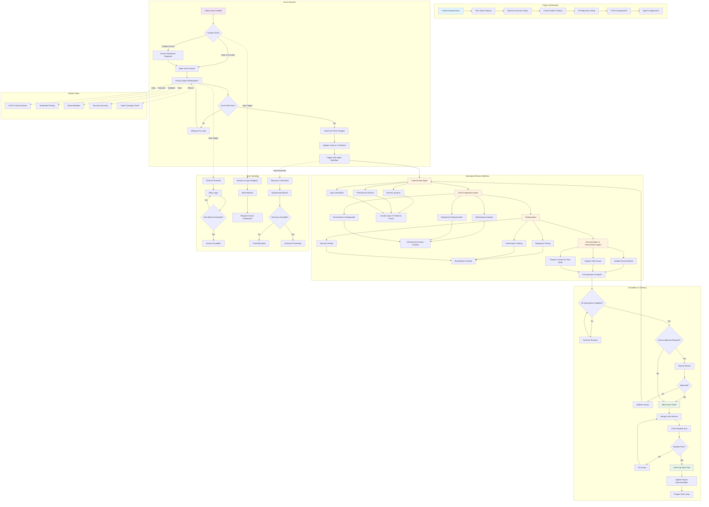

# SOP 06: Comprehensive Workflow Diagram

**Version:** 1.0  
**Created:** 2025-01-31  
**Last Modified:** 2025-01-31  

## Overview

This document provides a comprehensive visual representation of the AI-driven software development workflow, from project initialization through issue completion and cleanup. The workflow ensures quality, traceability, and consistency across all development activities.

## Complete Workflow Diagram

## Workflow Phase Descriptions

### Phase 1: Project Initialization
**Purpose:** Establish project foundation and infrastructure
**Key Activities:**
- Create foundational documents (PRD, Tech Stack, etc.)
- Set up directory structure and Git repository
- Configure Linear project and CI/CD pipeline
- Initialize AI agent configuration and templates

**Success Criteria:**
- All foundation documents completed and approved
- Repository structure established with proper branching
- Linear project configured with templates and labels
- All agents can successfully interact with systems

### Phase 2: Issue Lifecycle Management
**Purpose:** Execute individual development tasks with proper isolation
**Key Activities:**
- Context checking to prevent duplicate work
- Work tree creation for isolated development
- Primary agent implementation with quality gates
- Continuous testing and validation

**Success Criteria:**
- No duplicate or conflicting work initiated
- All development occurs in isolated environments
- Local testing passes before integration
- All activities logged and traceable

### Phase 3: Sub-Agent Review Workflow
**Purpose:** Comprehensive quality assurance through specialized reviews
**Key Activities:**
- Sequential execution of four specialized review agents
- Security, performance, and logic analysis
- CI/CD impact assessment and deployment planning
- Comprehensive testing beyond unit tests
- Documentation updates and next issue preparation

**Success Criteria:**
- All four sub-agent reviews completed successfully
- Critical issues identified and addressed
- Comprehensive test coverage achieved
- Documentation updated and next work prepared

### Phase 4: Completion & Cleanup
**Purpose:** Finalize work and prepare for next development cycle
**Key Activities:**
- Validation of all sub-agent completion
- Human approval for critical changes
- Integration to dev branch and CI/CD execution
- Work tree cleanup and documentation updates

**Success Criteria:**
- All quality gates passed
- Code successfully integrated and deployed
- Work environment cleaned up completely
- Project ready for next development cycle

## Critical Decision Points

### Context Check (Decision Diamond I)
**Trigger:** Before beginning any development work
**Evaluation:** Check for duplicate or conflicting issues
**Outcomes:**
- **Conflicts Found:** Halt work and require human resolution
- **Clear to Proceed:** Continue with work tree creation

### Local Tests Pass (Decision Diamond M)
**Trigger:** After primary implementation completion
**Evaluation:** All automated tests and build processes
**Outcomes:**
- **Tests Fail:** Enter debug and fix loop with self-correction
- **Tests Pass:** Proceed to commit and integration

### All Sub-Agents Complete (Decision Diamond V)
**Trigger:** After documentation & orchestration agent completion
**Evaluation:** Verify all four sub-agent reviews are done
**Outcomes:**
- **Reviews Incomplete:** Continue waiting for completion
- **All Complete:** Proceed to human approval check

### Human Approval Required (Decision Diamond X)
**Trigger:** When all sub-agent reviews are complete
**Evaluation:** Determine if human oversight needed based on:
  - Security-sensitive changes
  - Architectural modifications
  - Business-critical functionality
**Outcomes:**
- **Approval Required:** Human review process initiated
- **No Approval Needed:** Proceed directly to completion

### CI/CD Pipeline Pass (Decision Diamond EE)
**Trigger:** After merge to dev branch
**Evaluation:** Automated pipeline execution results
**Outcomes:**
- **Pipeline Fails:** Return to fix issues and retry
- **Pipeline Passes:** Proceed to cleanup and finalization

## Quality Gates Integration

The workflow incorporates multiple quality gates that operate throughout the development process:

### Pre-Commit Quality Gates
- **Git Pre-Commit Hooks:** Enforce code formatting, linting, and basic validation
- **Automated Testing:** Execute unit test suite before allowing commits
- **Build Validation:** Ensure code compiles and builds successfully
- **Security Scanning:** Check for basic security vulnerabilities
- **Code Coverage Check:** Verify test coverage meets minimum thresholds

These gates are integrated into the primary development loop and must pass before work can proceed to the review phase.

## Error Handling Pathways

### Technical Failures
**Common Scenarios:** Build failures, test failures, integration errors
**Response:** Automated retry logic with exponential backoff
**Escalation:** Human intervention after maximum retry attempts

### Business Logic Ambiguity
**Common Scenarios:** Unclear requirements, conflicting specifications
**Response:** Mark issue as blocked and request human clarification
**Prevention:** Comprehensive BDD scenario creation during issue analysis

### Resource Constraints
**Common Scenarios:** API rate limits, system resource exhaustion
**Response:** Exponential backoff and alternative resource seeking
**Adaptation:** Dynamic adjustment of processing strategies

## Workflow Performance Metrics

### Velocity Metrics
- **Issue Completion Time:** Average time from start to done
- **Sub-Agent Review Duration:** Time for complete review workflow
- **Error Resolution Time:** Time to resolve technical failures

### Quality Metrics
- **First-Pass Success Rate:** Issues completed without rework
- **Bug Discovery Rate:** Issues found by sub-agent reviews
- **Pipeline Success Rate:** CI/CD pipeline pass percentage

### Efficiency Metrics
- **Context Check Effectiveness:** Duplicate work prevention rate
- **Work Tree Utilization:** Concurrent development efficiency
- **Documentation Currency:** Project documentation accuracy rate

## Continuous Improvement

The workflow is designed for continuous improvement through:
- Metric collection and analysis at each phase
- Regular review of error patterns and resolution strategies
- Refinement of quality gates based on defect analysis
- Optimization of sub-agent review processes based on findings

## Integration Points

### Linear Integration
- Issue creation, status updates, and activity logging
- Sub-issue creation for agent work tracking
- Context queries for duplicate work prevention

### Git Integration
- Work tree management for isolated development
- Branch management and merge coordination
- Hook integration for quality gate enforcement

### CI/CD Integration
- Automated pipeline triggering on dev branch updates
- Quality gate integration with build and test processes
- Deployment coordination with infrastructure requirements

This comprehensive workflow ensures that every aspect of development is properly managed, tracked, and quality-assured while maintaining the flexibility needed for complex software projects.